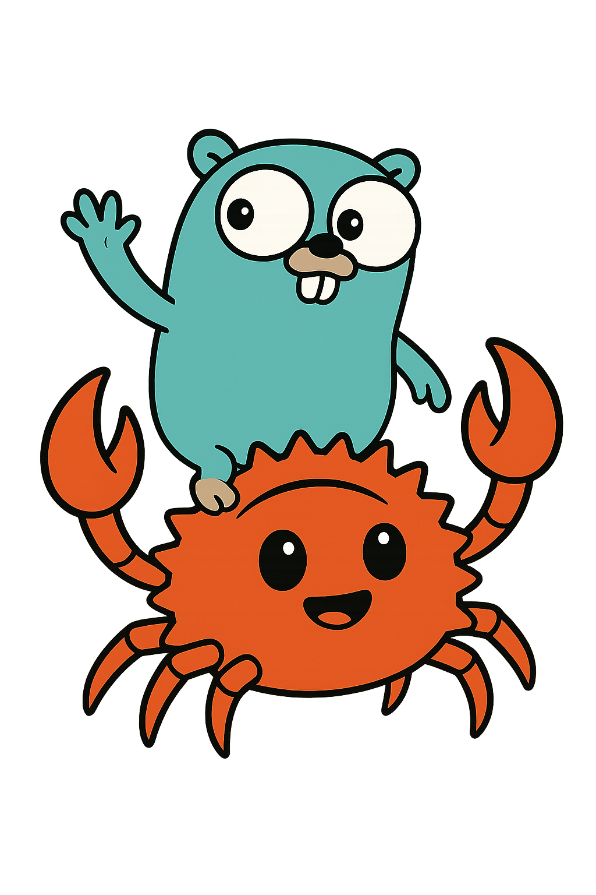

# go-polars



This simple project was created to bind between polars with Golang.
So what is polars?
Polars is an open-source library for data manipulation, known for being one of the fastest data processing solutions on a single machine. It features a well-structured, typed API that is both expressive and easy to use.

https://github.com/pola-rs/polars

## Installation
```bash
make -v
```

```bash
sudo apt-get install build-essential
```

```bash
make local-build
make run-basic-example
```

## License
This project is licensed under the MIT License. See the [LICENSE](LICENSE) file for details.

---